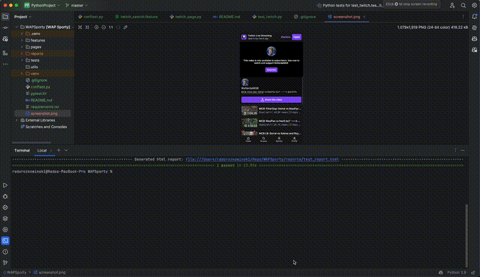

# Twitch Search Test Automation - Home Test - AQA (WAP)

## Overview
This project automates mobile web testing for Twitch using **PyTest-BDD** with **Selenium WebDriver**. The test framework performs a search on Twitch, scrolls through results, selects a streamer, validates the page, and captures a screenshot.

## Technologies Used
- **Python** (Test automation scripting)
- **PyTest-BDD** (Behavior-driven development framework)
- **Selenium WebDriver** (Web automation)
- **Google Chrome Mobile Emulator** (Simulating mobile devices)
- **WebDriver Manager** (Handling browser drivers)
- **Gherkin Syntax** (Defining test scenarios in `.feature` files)

## Project Structure
```
├── tests
│   ├── conftest.py         # WebDriver fixture setup
│   ├── test_twitch.py      # PyTest-BDD test implementation
│
├── pages
│   ├── twitch_page.py      # Page Object Model for Twitch
│
├── features
│   ├── twitch_search.feature  # BDD feature file
│
├── reports
│   ├── test_report.html    # HTML test report (generated after test execution)
│
├── pytest.ini              # PyTest configuration
└── README.md               # Project documentation
```

## Test Flow
1. Open Twitch mobile site.
2. Accept the consent banner (if present).
3. Click on the search icon.
4. Input a search term (e.g., **StarCraft II**).
5. Scroll down a configurable number of times.
6. Select a visible streamer.
7. Validate that the streamer page has loaded.
8. Take a screenshot of the final page.

## How to Run the Tests
### 1️⃣ Install Dependencies
Ensure you have **Python 3.9+** installed, then run:
```sh
pip install -r requirements.txt
```

### 2️⃣ Run Tests
Execute the test suite with:
```sh
pytest -v --html=reports/test_report.html --self-contained-html
```

### 3️⃣ View Test Report
After execution, open the HTML test report:
```sh
open reports/test_report.html
```

## Key Features & Solutions Used
### ✅ **Behavior-Driven Development (BDD)**
- Uses **Gherkin syntax** in `.feature` files for clear test case definitions.
- Implements **step definitions** in `test_twitch.py`.

### ✅ **Page Object Model (POM)**
- Encapsulates Twitch page interactions in `pages/twitch_page.py`.
- Improves maintainability by separating UI logic from test logic.

### ✅ **Selenium WebDriver with Mobile Emulation**
- Simulates Twitch behavior on different mobile devices.
- Uses Chrome’s built-in mobile emulator.

### ✅ **PyTest Fixtures & Parameterization**
- `conftest.py` handles **WebDriver setup and teardown**.
- Allows testing across multiple device configurations.

## Troubleshooting
### WebDriver Not Starting?
Ensure **Google Chrome** is installed and updated. Then, reinstall WebDriver:
```sh
pip install --upgrade webdriver-manager
```

### Tests Running Too Fast or Elements Not Found?
Try increasing **explicit wait time** in `twitch_page.py`:
```python
self.wait = WebDriverWait(driver, 15)  # Increase from 10s to 15s
```

## Next Steps / Enhancements
- ✅ Add **support for multiple mobile devices** via JSON configuration.
- ✅ Implement **headless mode** for faster CI/CD execution.

## Contributors
- **Developer:** Rado Rozkowinski

## 📺 Demo



